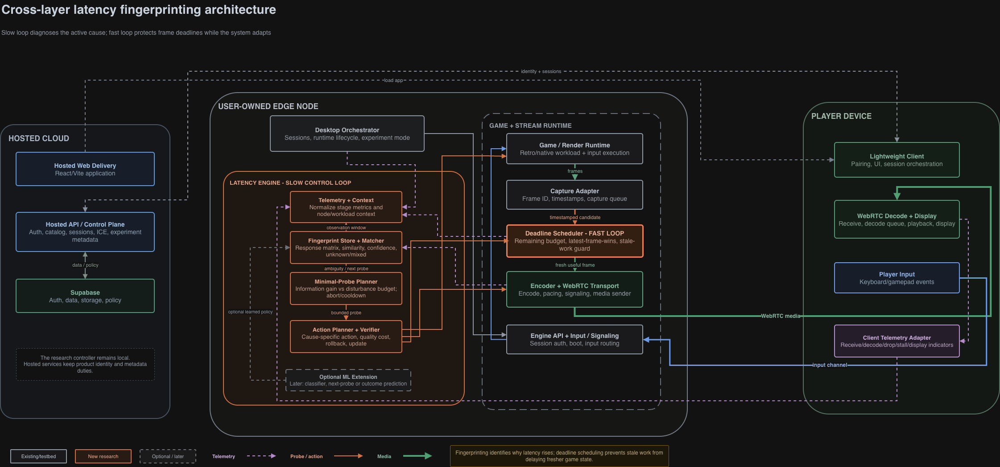

# Latency-Fingerprinting Architecture

**Decision:** Detached Python research core with TypeScript/Node testbed adapters

## System boundary

Existing Pixelated components continue to own:

- browser WebRTC telemetry collection;
- research-run bundle export;
- Electron and Docker orchestration;
- game/session lifecycle;
- runtime stream settings and future action adapters.

The Python core owns:

- contract validation;
- observation-window aggregation;
- response-delta calculation;
- normalization;
- file-based fingerprint loading;
- interpretable matching and `unknown` handling;
- evidence generation;
- offline experiments and later statistical/ML analysis.

The future deadline scheduler remains in the capture/GStreamer runtime because per-frame decisions must not depend on a slow external process.

## Data flow

P0 exercises the research core with synthetic fixtures and controlled-real
paired observation windows. A probe is represented by metadata plus its
degraded and relief windows; the Python core analyzes the recorded intervention
but does not execute it against a live engine.

```text
Pixelated browser/runtime or synthetic fixture
    -> versioned bundle or contract windows
    -> Pixelated adapter when needed
    -> degraded + relief observation windows + probe
    -> raw response delta
    -> normalized response vector
    -> compatible file-based fingerprints
    -> weighted-distance matcher
    -> matched or unknown JSON result

Future slow loop:
    Python diagnosis/policy -> bounded runtime action adapter

Future fast loop:
    capture/GStreamer deadline scheduler -> frame-local decision
```

Loose coupling is established through contracts and adapters. P0 does not create another desktop application, daemon or HTTP service.

## N1 shadow measurement foundation

The completed N1 registry, extraction, aggregation and inspection milestones add strict immutable
measurement definitions, a canonical 31-output registry, raw timestamped samples
and auditable gauge/counter summaries alongside P0.
Definitions specify raw source
fields, physical units, clocks, aggregation and gap/reset policies. The registry
and generated schema have deterministic export/check commands and CI drift gates.
P0 normalization and matching continue to use their frozen configuration.

```text
Implemented: source-declared definitions -> strict registry -> schema/artifact export/check
             bounded bundle reader -> immutable raw timestamped samples
             registered gauge/counter aggregation -> immutable series summaries
             P0 comparison -> diagnostic shadow/migration report
Verified:    independent synthetic arithmetic fixtures and read-only drift checks
Planned:     final quality/CI integration and N1 closeout
```

Registry metadata uses fixed release versions and creation time. Legacy exported
elapsed timestamps retain their wall-clock-derived limitation; a registry clock
label does not assert verified monotonic capture. No observation-v2 root, live
instrumentation or matcher adoption is included. The implemented boundary and
next step are documented in the
[`canonical registry guide`](measurement/CANONICAL_REGISTRY.md).

## Target system overview



This diagram shows the intended full system, not the completed P0 feature set.
P0 implements the offline response-analysis path described above. Live probe
planning, autonomous actions and outcome verification, mixed-cause inference,
calibrated confidence, the deadline scheduler and optional ML remain future work.
The diagram's matcher-before-probe ordering represents hypothesis narrowing or
reuse of existing compatible evidence; response matching still requires a
measured response to a compatible probe. P0 match strength is not a calibrated
probability.

The [full-size diagram](diagrams/latency-fingerprinting-architecture.png) is a PNG
export. Its editable source is not currently included in this repository.

## Repository structure

```text
latency-fingerprinting/
├── README.md
├── pyproject.toml
├── docs/
│   ├── ARCHITECTURE.md
│   ├── diagrams/
│   ├── p0/
│   ├── measurement/
│   └── plans/
├── schemas/
│   ├── observation-v1.schema.json
│   ├── fingerprint-v1.schema.json
│   ├── match-result-v1.schema.json
│   ├── metric-registry-v1.schema.json
│   └── metric-registry-v1.json
├── src/latency_fingerprinting/
│   ├── models/
│   │   ├── common.py
│   │   ├── context.py
│   │   ├── response.py
│   │   ├── fingerprint.py
│   │   ├── measurement.py
│   │   └── match.py
│   ├── validation.py
│   ├── windows.py
│   ├── measurement/
│   │   ├── feature_config.py
│   │   ├── metric_registry.py
│   │   └── p0_feature_config.py
│   ├── normalization.py
│   ├── pipeline.py
│   ├── fingerprints.py
│   ├── matcher.py
│   ├── matching/
│   │   ├── compatibility.py
│   │   ├── scoring.py
│   │   └── decision.py
│   ├── synthetic/
│   │   ├── builders.py
│   │   ├── definitions.py
│   │   ├── expectations.py
│   │   └── rendering.py
│   ├── evidence.py
│   ├── schemas.py
│   ├── json_io.py
│   ├── cli.py
│   ├── __init__.py
│   └── adapters/
│       ├── pixelated_bundle.py
│       ├── pixelated_bundle_common.py
│       ├── pixelated_bundle_io.py
│       ├── pixelated_bundle_metrics.py
│       ├── pixelated_measurement_samples.py
│       ├── pixelated_bundle_validation.py
│       └── pixelated_bundle_v2.py
├── fixtures/
│   ├── reference_cases/
│   │   ├── network_pressure/
│   │   └── host_encoder_pressure/
│   └── query_cases/
│       ├── similar_network/
│       ├── similar_encoder/
│       ├── ambiguous/
│       ├── conflicting/
│       ├── incompatible_context/
│       └── weak/
├── experiments/
│   ├── controlled-run-001/
│   └── controlled-run-002/
└── tests/
    ├── data/
    ├── measurement/
    ├── models/
    └── pixelated/
```

Package markers (`__init__.py`) and the CLI module entry point (`__main__.py`)
are implemented. Virtual environments, caches and large/private raw experiment
bundles are ignored by Git.

Each fixture case contains paired `degraded.json` and `relief.json` observation
windows plus an expected fingerprint or match result. Reference cases build the
known fingerprint library; query cases test matching and conservative `unknown`
handling. Fixtures are stable regression inputs, while `experiments/` stores
artifacts from the completed controlled-real runs and their processing tools.

## Python choice

Use Python 3.11 or newer for the detached core because:

- the matcher operates offline or over slow observation windows;
- Python has strong numerical, statistical and visualization tooling;
- later ML work can reuse the same records;
- it is common and inspectable in research environments;
- no working product component needs to be rewritten.

P0 runtime dependency:

- Pydantic 2;

Development tools:

- pytest;
- pytest-cov;
- Ruff.
- jsonschema (N1 registry artifact validation in tests only).

Use standard-library `argparse` for the CLI. Do not add pandas, scikit-learn, FastAPI, SQLite or notebook infrastructure unless a concrete P0 blocker requires one.

Public JSON file boundaries use `json_io.py` to reject duplicate keys,
non-finite constants, finite JSON syntax that overflows the runtime float,
excessive nesting, invalid UTF-8 and oversized records before model validation.
The Pixelated boundary additionally caps compressed archive bytes, declared
archive contents, members, per-file bytes, total readable bytes and CSV rows;
rejects links and duplicate TAR members; and
cross-checks workload/session identity plus browser/engine clock alignment.
Fingerprint discovery also caps matching files, total traversed directory
entries and nesting depth without following links. Finite source numbers are
checked again after delta, median and normalization arithmetic so representable
inputs cannot silently become infinities.

Pydantic models are the Python source of truth. Checked-in JSON Schemas are
generated from the models with sibling temporary files and atomic replacement;
a regression test prevents drift.

## Runtime constraint

The current camera bridge receives FPS, bitrate and encoder profile through `PIXELATED_STREAM_PROFILE` when it launches. It does not safely mutate the running GStreamer `vp8enc`.

Therefore:

- P0 models controlled probes with paired synthetic or controlled-real windows;
- P0 does not claim live in-session probing;
- controlled-real paired runs are ingested through the completed Pixelated
  adapter;
- dynamic bounded probing is deferred until the runtime exposes a tested mutation and rollback path.

## Deferred architecture

P0 does not include:

- an HTTP or gRPC fingerprint service;
- a separately installed latency-engine application;
- SQLite or hosted storage;
- autonomous action execution;
- the deadline scheduler;
- ML serving;
- distributed multi-node coordination.
